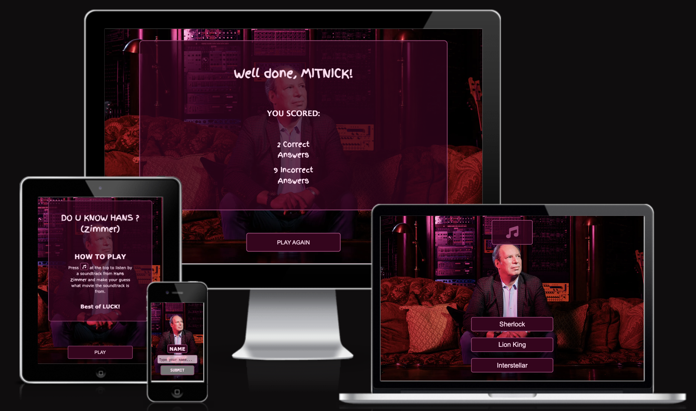
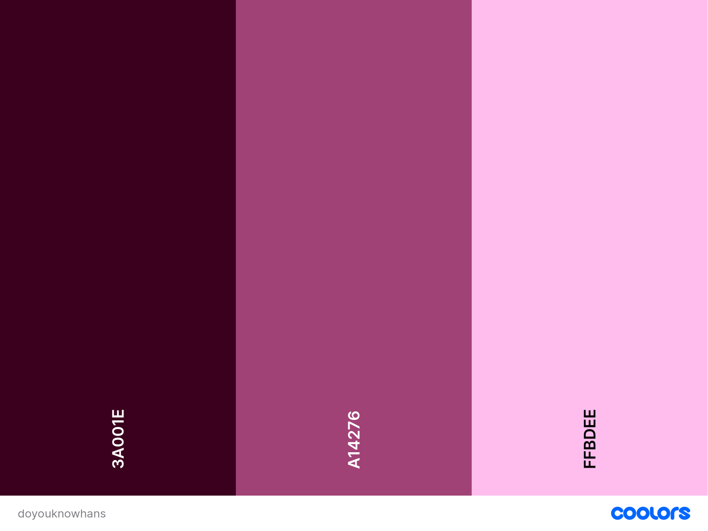
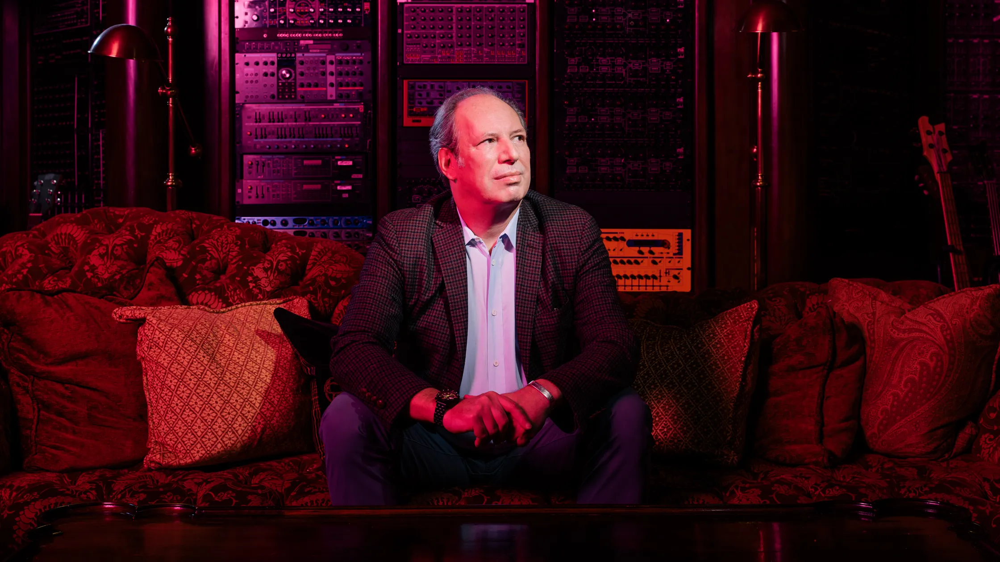
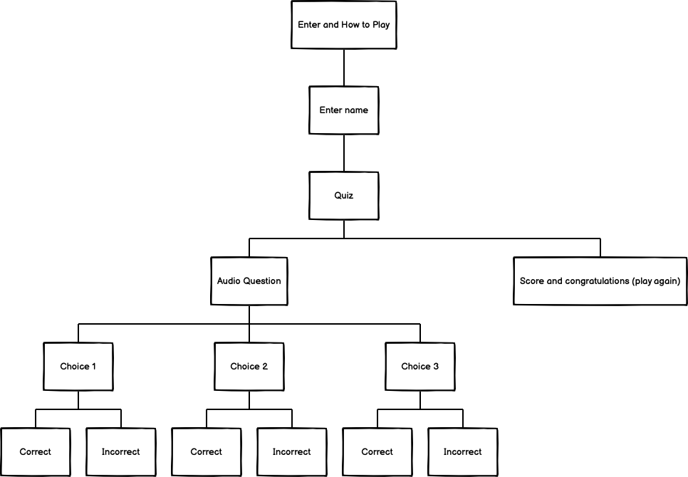
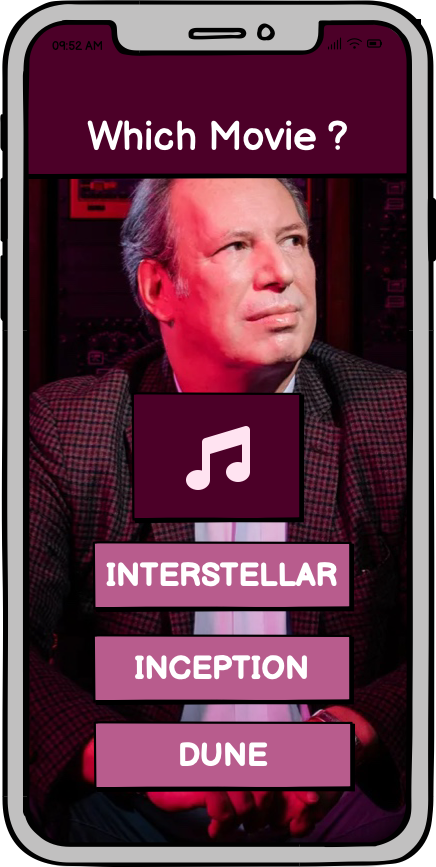
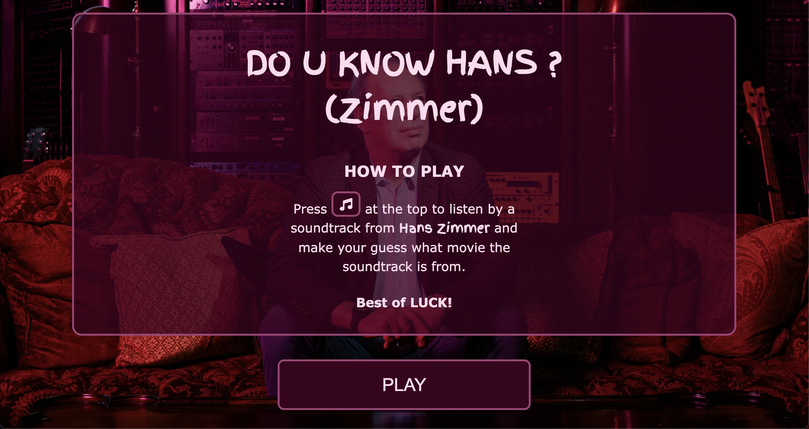
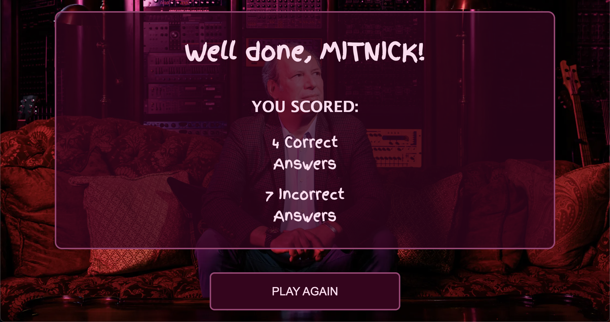

# Do u know Hans?

This site is a quiz website where you listen instead of reading. The purpose is to have fun and hopefully at the same time learn something. It's a quite niched quiz about one of the better film composers of our time: Hans Zimmer.
This website is responsive and allowed to view on all devices.

You can reach the page link [here](https://andreasawenlof.github.io/do-u-know-hans/)
---

## CONTENTS

- [Do u know Hans?](#do-u-know-hans)
  - [You can reach the page link here](#you-can-reach-the-page-link-here)
  - [CONTENTS](#contents)
  - [User Experience (UX)](#user-experience-ux)
    - [Key information for the site](#key-information-for-the-site)
    - [User Stories](#user-stories)
      - [Client Goals](#client-goals)
      - [Visitor Goals](#visitor-goals)
  - [Design](#design)
    - [Color Scheme](#color-scheme)
    - [Thoughts behind choosing this color scheme:](#thoughts-behind-choosing-this-color-scheme)
    - [Typography](#typography)
      - [Finger Paint](#finger-paint)
    - [Other Fonts](#other-fonts)
    - [Imagery](#imagery)
    - [Wireframes](#wireframes)
  - [Features](#features)
    - [General features on each page](#general-features-on-each-page)
    - [Favicon](#favicon)
    - 
      - [Background exists on every page](#background-exists-on-every-page)
    - [The Home Page](#the-home-page)
    - [Name Input Section](#name-input-section)
    - [Quiz Section](#quiz-section)
    - [Score Section](#score-section)
    - [404 Error Page](#404-error-page)
    - [500 Error Page](#500-error-page)
    - [Future Implementations](#future-implementations)
    - [Accessibility](#accessibility)
    - [Languages Used](#languages-used)
    - [Frameworks, Libraries \& Programs Used](#frameworks-libraries--programs-used)
  - [Deployment \& Local Development](#deployment--local-development)
    - [Deployment](#deployment)
    - [Local Development](#local-development)
      - [How to Fork](#how-to-fork)
        - [To Fork the pp1-final repository:](#to-fork-the-pp1-final-repository)
      - [How to Clone](#how-to-clone)
        - [To Clone the pp1-final repository:](#to-clone-the-pp1-final-repository)
      - [Deploy in VSCode](#deploy-in-vscode)
        - [If you use VSCode here are the instructions:](#if-you-use-vscode-here-are-the-instructions)
  - [Testing](#testing)
  - [Credits](#credits)
    - [Code Used](#code-used)
    - [Content](#content)
    - [ Media](#media)
      - [Used Media](#used-media)
    - [ Acknowledgments](#acknowledgments)
  - [Final Thoughts and Comments](#final-thoughts-and-comments)

---

## User Experience (UX)

Do you know Hans? Is an audio quiz about the composer Hans Zimmer. Where you can listen to different music clip while trying to guess and pair them up with the correct movie the audios is from. Eh you're supposed to have and maybe also learn something. You start by entering the main site where you can read the rules see the title of the quiz and enter the quiz. You get linked into page where you type your name and can start the quiz. Score points will be stored and will be revealed when you've done the quiz, your name is also stored and you get a personal message in the end where you also can play again to better your score.

### Key information for the site
 - Read the rules
 - Enter your name
 - Play the game
 - Check your score

### User Stories

#### Client Goals

- To view the site on a range of different devices
- To understand the rules of the quiz
- To be able to listen to some amazing soundtracks
- To maybe become more interested in the soundtracks and knowing more about them and maybe listening to the in their entirety.
- To have a clear and clean interface where the choices are clear.

#### Visitor Goals
- I want to know what the artist is about and through that know if i'm interested or not
- I want to be able to listen or watch the artist media either on the site or being able to click external links that can open in a new tab
- I want to be able to contact the artist or send them a message

## Design

### Color Scheme

### Thoughts behind choosing this color scheme:
Because i use the same background image on every page i wanted to find a color scheme that was through a color color picked from the background. I used adobe color wheel for this and found a good color scheme. I felt that it was enough variation with 3 colors, creating a constant theme, the background has quite a lot so felt like more colors would be too much and maybe create too much separation through the entire theme of the project.

### Typography
I imported one custom font and use it for the title, a few headers. It fit overall with the page in my opinion.

#### Finger Paint
Reason behind this font is that it kind of wrote a bit of "playfulness" into the the "serious" feeling, with Hans in the background. Kind of inflick to the user to not take themselves to serious, it's about to have fun in the end.

### Other Fonts
Other standard fonts I've used:
Verdana
Monospace
Impact

### Imagery

I've used one background image as a foundation for everything:

### Wireframes
I've used balsamic for an overall, feel, color schemes and just the theme and overall design of the page for mobiles.

This is the tree structure of my idea

This is the first prototype on how i wanted the design of the quiz. 

## Features
The page consist of an Home Page, Name Page, Game Page, Score Page, 404 and 500 page.

The whole site is responsive and works well for all kind of different devices.

### General features on each page

### Favicon
 that represents the Hans Zimmer Logo, knowing it has something to do with him.
Favicon exists on every page.

###

#### Background exists on every page

- Background is not as showing to the sides.
- Content is clearly visible not not be confusing where to look.
- I went with a color scheme that fits the background.
- Transparent to even if it's a smaller screen make the content feel like it has more "space".

### The Home Page
Consist of a title of the Quiz and a clear instruction on how to play the game. The Home Page is important cause it's supposed to attract the user to click further to play the game. Colors are theme'd with the background to fit the overall theme. 

### Name Input Section
Here you input your name. The name will be stored through the whole game and show in the end with the summarize of the score. Submit button is also disabled when there is not input in the input field but as soon as there in information the submit button is being enabled.

### Quiz Section
Here you play the quiz. You click on the button up top with the music note to hear a clip of a soundtrack and try to guess through the choices below what movie is connected to the soundtrack one is listening to. When you pick a choice you'll be redirected to the next question randomly and the audio-clip connected to that quiz question will be loaded so you can press the music-button again to hear the new soundtrack-clip.
- The choice buttons also indicate in green or red regarding if you're correct or incorrect. 
- The choice buttons have an hover effect to know what choice you're about to pick.
- The music button also has a active and focus mode showing that the user has pressed the button and music is playing.

### Score Section
This is the page you land after you've played the quiz. Here you will be congratulated for a job well done. The name an score has been saved into local storage so we can congratulate the user personally with their name and also that they can see how many questions they got correct/incorrect. 
- Play Again button to be redirected to the start of a new quiz with the score reset but still having the same name.

### 404 Error Page
Alerts the user that the page cannot be found and a button to redirect them back to the home page.

### 500 Error Page
Alerts the user that of a an error and a button to redirect them back to the home page.

### Future Implementations
- A score counter that starts from the top and the further they listen to the music the less score they get. When they listen to the whole music clip, they won't be able to answer anymore and the score will be zero showing the right answer and redirect to the next question. 
- A summary where you can see on the score page, what movies you maybe need to watch/rewatch showing what you missed.
- A high score section where user can see their score and better them, need backend implementation for that though.
- Introducing a hard-mode where you actually only see if you're correct or wrong but won't see the correct answer.

### Accessibility

- Semantic HTML have been used for better anc clearer accessibility for screen readers. 
- Hover state on links to easier see where the mouse pointer is over.
- Hover state is also disabled for touch devices to not make hover-effects get stuck and show inconsistencies.
- With the hover removal for touching devices I've used coarse vs fine-pointer in CSS meaning that if you have a stylus you actually have the hover as well. Make it a bit more distinct.
- Colors with enough contrast to see clearly different elements.
- Used Sans-Serif fonts for better accessibility to people with dyslexia.
- An active and focus pseudo selector to show that the "music" button in the quiz is pressed down and the music is playing.

- Added aria-labels on all links and some headers to help screen-readers better understand and navigate the project.
- Passed contrast checker.

### Languages Used
- HTML, CSS and Javascript has been used.
- A lot of Javascript have been used to make the page as interactive as possible and provide the best possible user experience.

### Frameworks, Libraries & Programs Used
- Git - For version control
- Github - To save and store files for the website
- Fontawesome - For the "audio play"-icon.
- Favicons - To find the favicon used.
- Spotify - To record audio tracks from.
- Rogue Amoeba Loopback - To reroute Spotify audio to be able to record properly
- Logic Pro X - To cut all the audio clips and process them with fade ins/outs for a smoother experience

## Deployment & Local Development
The site is deployed using Github Pages - [Do u know Hans?](https://andreasawenlof.github.io/do-u-know-hans/)

### Deployment
The instructions to achieve this are below:
1. Log in (or sign up) to Github.
2. Find the repository for this project, "do-u-know-hans"
3. Click on the Settings link.
4. Click on the Pages link in the left hand side navigation bar.
5. In the Source section, choose main from the drop down select branch menu. Select Root from the drop down select folder menu.
6. Click Save. Your live Github Pages site is now deployed at the URL shown.

### Local Development

#### How to Fork
##### To Fork the pp1-final repository:
1. Log in (or sign up) to Github.
2. Go to the repository for this project, andreasawenlof/do-u-know-hans
3. Click the Fork button in the top right corner.

#### How to Clone
##### To Clone the pp1-final repository:
1. Log in (or sign up) to GitHub.
2. Go to the repository for this project, andreasawenlof/do-u-know-hans.
3. Click on the code button, select whether you would like to clone with HTTPS, SSH or GitHub CLI and copy the link shown.
4. Open the terminal in your code editor and change the current working directory to the location you want to use for the cloned directory.
5. Type 'git clone' into the terminal and then paste the link you copied in step 3. Press enter.

#### Deploy in VSCode
##### If you use VSCode here are the instructions:
1. Click on this icon    to go to extensions.
2. Search for "Live Server".
3. Click Install
4. When installed you might need to restart VSCode.
5. When inside the project you see in the bottom right corner "Go Live".
6. Click on that and the page will open up locally in you browser.
7. This will update in realtime when you make changes in the project on VSCode.

## Testing
See attached [TESTING.md](TESTING.md)

## Credits

- [Kera's testing-template](https://github.com/kera-cudmore/readme-examples/blob/main/milestone1-testing.md)
- [Kera's TheQuizArms](https://github.com/kera-cudmore/TheQuizArms/blob/main/README.md)
- [Kera's TheQuizArms](https://github.com/kera-cudmore/TheQuizArms/blob/main/TESTING.md)
- https://www.freecodecamp.org/news/how-to-remove-an-element-from-a-javascript-array-removing-a-specific-item-in-js
- https://flexiple.com/javascript/loop-through-object-javascrip
- https://www.freecodecamp.org/news/how-to-convert-a-string-to-a-number-in-javascript/

### Code Used

- I've written all code myself.
- Idea was my own and actually haven't looked that much on other projects.
- When I google'd or searched for something i never copied but wrote it properly myself to fit my own project and all the few sites I've used are in the credits section.

### Content
- All the content is written by me.
- README.md was inspired by links above but not copied nor plagiarized.
- TESTING.md was inspired by links above but not copied nor plagiarized.
- I might've been inspired and impacted by certain credits and sources to write README and TESTING, but everything is reworked to fit my own project the best.

###  Media
#### Used Media
- Used Media
- I've recorded soundtracks of Hans Zimmer tracks from spotify and then cut them to pieces in Logic Pro X for academic purposes.
- I recorded of Spotify and these are the movies i use soundtracks from:
  - Interstellar
  - Inception 
  - Dunkirk
  - Batman - Dark Knight
  - The Pirates of the Caribbean (Abbreviated as "Pirates")
  - Sherlock Holmes (Abbreviated as "Sherlock")
  - The Lion King (Abbreviated as "Lion King")
  - Gladiator
  - Dune
  - Man of Steel
  - Rush
  - The Last Samurai (Abbreviated as "Last Samurai")
    
  
###  Acknowledgments
- Thanks to the Swedish Community on slack for being absolute Legends.

- Thanks to:
  - To Hans Zimmer for making amazing music.
  - Thanks for Christopher Nolan and Denis Villeneuve for making amazing masterpieces for Hans Zimmer to score to.
  - CI Academy for providing a great learning experience.

## Final Thoughts and Comments
- I made almost everything javascript first and realized when i was pretty much done with the core hard work that I missed to commit. So to become a learning experience nad instead o editing etc after I remade Javascript from scratch to make it a learning experience as well as i could commit properly.

- Kind of had an idea from the beginning. I wanted to do something different, and came up with what about you listen to audio instead? 
Balsamiq helped me realize this idea so i could see it. After it was pretty much about to make what was in Balsamiq look like that in coding. I had a lot of fun and there is so much more i want to implement cause I never would wanna settle with average just to pass. I want to do the best I can. After all this will be my portfolio to be able to apply for future jobs.
  
- I recorded 3-4 whole tracks from Hans Zimmer from the 12 different movies. 
- I then imported it to Logic Pro X and choose the best bits to cut them to 1 minute clips. 
- To not give the user a shock when they start I also faded in and out the clips to make them start and finish smoothly.
- I know this has nothing to do with coding, but this was the preparation for the project and I never were a firm believer in average.