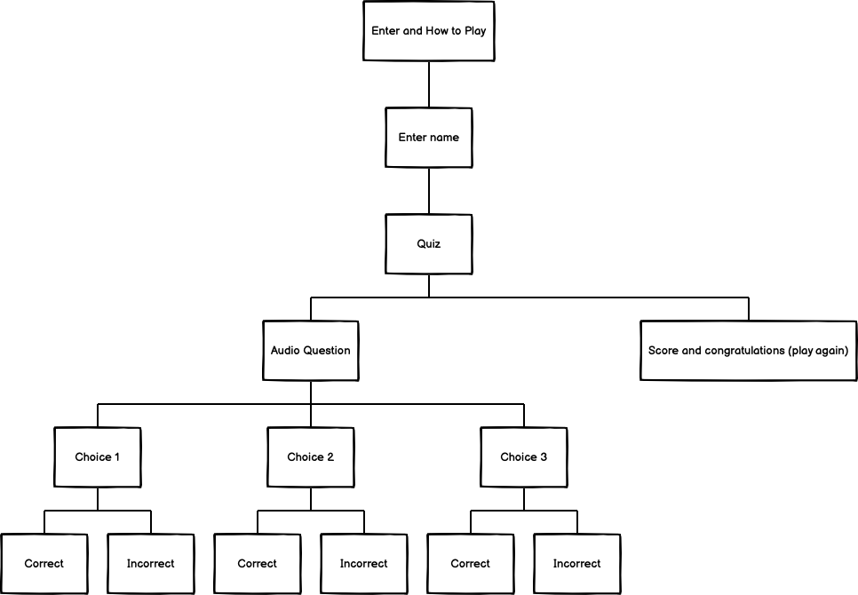
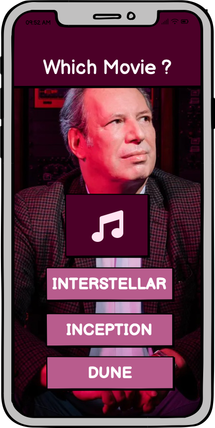

# Do u know Hans?

This site is a quiz website where you listen instead of reading. The purpose is to have fun and hopefully at the same time learn something. It's a quite niched quizz about one of the better film composers of our time: Hans Zimmer.
This website is responsive and allowed to view on all devices.

You can reach the page link [here](https://andreasawenlof.github.io/do-u-know-hans/)
---

## CONTENTS

- [Do u know Hans?](#do-u-know-hans)
  - [You can reach the page link here](#you-can-reach-the-page-link-here)
  - [CONTENTS](#contents)
  - [User Experience (UX)](#user-experience-ux)
    - [Key information for the site](#key-information-for-the-site)
    - [User Stories](#user-stories)
      - [Client Goals](#client-goals)
      - [First Time Visitor Goals](#first-time-visitor-goals)
      - [Returning Visitors Goals](#returning-visitors-goals)
  - [Design](#design)
    - [Color Scheme](#color-scheme)
    - [Thoughts behind choosing this color scheme:](#thoughts-behind-choosing-this-color-scheme)
    - [Typography](#typography)
      - [Protest Revolution](#protest-revolution)
    - [Imagery](#imagery)
    - [Wireframes](#wireframes)
  - [Features](#features)
    - [General features on each page](#general-features-on-each-page)
    - [Favicon](#favicon)
    - 
      - [Mobile](#mobile)
      - [Desktop](#desktop)
    - [Footer](#footer)
      - [Mobile](#mobile-1)
      - [Desktop](#desktop-1)
    - [The Enter Page](#the-enter-page)
    - [Name Input Section](#name-input-section)
    - [Quiz Section](#quiz-section)
    - [Score Section](#score-section)
    - [404 Error Page](#404-error-page)
    - [Future Implementations](#future-implementations)
    - [Accessibility](#accessibility)
    - [Languages Used](#languages-used)
    - [Frameworks, Libraries \& Programs Used](#frameworks-libraries--programs-used)
  - [Deployment \& Local Development](#deployment--local-development)
    - [Deployment](#deployment)
    - [Local Development](#local-development)
      - [How to Fork](#how-to-fork)
        - [To Fork the pp1-final repository:](#to-fork-the-pp1-final-repository)
      - [How to Clone](#how-to-clone)
        - [To Clone the pp1-final repository:](#to-clone-the-pp1-final-repository)
      - [Deploy in VSCode](#deploy-in-vscode)
        - [If you use VSCode here are the instructions:](#if-you-use-vscode-here-are-the-instructions)
  - [Testing](#testing)
  - [Credits](#credits)
    - [Code Used](#code-used)
    - [Content](#content)
    - [ Media](#media)
      - [Used Media](#used-media)
    - [ Acknowledgments](#acknowledgments)
  - [Final Thoughts and Comments](#final-thoughts-and-comments)

---

## User Experience (UX)

Do you know Hanz? Is an audio quiz about the composer Hans Zimmer. Where you can listen to different music clip while trying to guess and pair them up with the correct movie the audios is from. Eh you're supposed to hanve and maybe also learn something. You start by entering the main site where you can read the rules see the title of the quiz and enter the quiz. You get linked into page where you type your name and can start the quiz. Score points will be stored and will be revealed when you've done the quiz, your name is also stored and you get a personal message in the end where you also can play again to better your score.

### Key information for the site
 - Read the rules
 - Enter your name
 - Play the game
 - Check your score

### User Stories

#### Client Goals

- To view the site on a range of different devices
- To understand what the artist is about
- To be able to listen to music
- To relate and become a follower of her journey
- To have clear links and no confusion where to go

#### First Time Visitor Goals

- I want to know what the artist is about and through that know if i'm interested or not
- I want to be able to listen or watch the artist media either on the site or being able to click external links that can open in a new tab
- I want to be able to contact the artist or send them a message

#### Returning Visitors Goals
- I want to see updates of new releases
- I want to be able to contact her or send a message
- I want to still be able to relate and recognize myself as last time

## Design

### Color Scheme

### Thoughts behind choosing this color scheme:
Because i use the same background image on every page i wanted to find a color scheme that was through a color color picked from the background. I used adobe color wheel for this and found a good color shceme. I felt that it was enough variation with 3 colors, creating a constant theme, the background has quite a lot so felt like more colors would be too much and maybe create too much separation through the entire theme of the project.

### Typography
Fonts

#### Protest Revolution
The font's i've used are standard:
Verdana
Monospace
Impact

### Imagery

I've used one background image as a foundation for everything:

### Wireframes
This time I've used balsamic for an overall, feel, color schemes and just the theme and overall design of the page.

This is the tree structure of my idea

This is the first prototype on how i wanted the design of the quiz. 

## Features
The page consist of an index page, name page, quiz page, score page and 404 page.

The whole site is responsive and works well for all kind of different devices.

### General features on each page

### Favicon
 that represents that it's a music page and more an artist, singer page.

Favicon exists on every page.

###

Background exists on every page

#### Mobile

- Background is not as showing to the sides.
- Logo on top centered to easily see the artist name.
- The navigation links is inside the header and contrast with a darker background and lighter text color to make it clear and visible.

#### Desktop

- Consists of the logo (artist name) which also is a link to back to the homepage and a menu to the right to easily navigate to different pages.
- The links changes color when hovering to easily know what you're mouse is pointing over. 
- An active feature is added as an underline under the link to easily see what page you're on.
- The header is fixed and doesn't follow the flow of the rest of the page.

### Footer

The footer exists on every page

#### Mobile

- Footer with social-link-icons to easy visit social-media links of the artist (links opens in a new tab.) 
- Copyright information in the bottom center.
- Used the same colors for footer as for header to make it follow a consistent theme.
- The footer is fixed and doesn't follow the flow of the rest of the page.

#### Desktop

- Footer with social-link-icons to easy visit social-media links of the artist (links opens in a new tab.) 
- The links also has a hover effect when having your mouse pointer of the links in the same color as the header links for consistent colors with the overall theme. 
- Copyright information in the bottom center.
- Used the same colors for footer as for header to make it follow a consistent theme.
- The footer is fixed and doesn't follow the flow of the rest of the page.

Background is fixed, and all the content in front of it moves without the background moving.

### The Enter Page
The homepage consists of an about me section to read about the artist, what she is about and what her music is inspired by. This page is very crucial to attract the visitor as we want them to navigate further on the page.

### Name Input Section
- This page consist of header and embedded iframes of media. A Spotify link and several Youtube links. 
- The section is split up into 2 sections for clarity:
  - Music section
  - Video section
- The padding/background is transparent but the videos and the content is not transparent.

### Quiz Section
- The contact section consist of an h2 header and a form for the visitor to contact the artist.
- The input-fields are required which means a user must input information in all fields for it to be able to submit.
- A large textarea for the user to input a larger message for the communication to feel a bit more personal and intimate.
- A big submit button is added below the form to submit the contact form.

### Score Section

### 404 Error Page
- Information when the user inputs a non existing webpage. 
- Alert and information that the page cannot be reached and also a link to take the user back to the homepage.

### Future Implementations
- An update section where there is a "feature-section" like a new album or so. 
- Better source material, better quality and more proper links for the artist to express themselves.
- A Tour-section where visitors can follow the artist and come to their shows.
- An integrated section to maybe instagram or facebook to see latest photos or posts. 

### Accessibility

- Semantic HTML have been used for better anc clearer accessibility for scree readers. 
- Hover state on links to easier see where the mouse pointer is over.
- Underline on desktop version to make sure user knows what page they're currently on.
- Colors with enough contrast to see clearly different elements.
- Used Sans-Serif fonts for better accessibility to people with dyslexia.

- Recognizable icons on social media links so it's easy to navigate and clear to see.
- Added aria-labels on all links to help screen-readers better understand and navigate the project.
- Passed contrast checker, had one problem it said but it's only them not understanding the media queries.

### Languages Used
- HTMLS and CSS have been used
- A lot of Javascript have been used to make the page as interactive as possible and provide the best user experience.

### Frameworks, Libraries & Programs Used
- Git - For version control
- Github - To save and store files for the website
- Fontawesome - For the "audio play"-icon.
- Favicons - To find the favicon used.

## Deployment & Local Development
The site is deployed using Github Pages - [Do u know Hans?](https://andreasawenlof.github.io/do-u-know-hans/)

### Deployment
The instructions to achieve this are below:
1. Log in (or sign up) to Github.
2. Find the repository for this project, "do-u-know-hans"
3. Click on the Settings link.
4. Click on the Pages link in the left hand side navigation bar.
5. In the Source section, choose main from the drop down select branch menu. Select Root from the drop down select folder menu.
6. Click Save. Your live Github Pages site is now deployed at the URL shown.

### Local Development

#### How to Fork
##### To Fork the pp1-final repository:
1. Log in (or sign up) to Github.
2. Go to the repository for this project, andreasawenlof/do-u-know-hans
3. Click the Fork button in the top right corner.

#### How to Clone
##### To Clone the pp1-final repository:
1. Log in (or sign up) to GitHub.
2. Go to the repository for this project, andreasawenlof/do-u-know-hans.
3. Click on the code button, select whether you would like to clone with HTTPS, SSH or GitHub CLI and copy the link shown.
4. Open the terminal in your code editor and change the current working directory to the location you want to use for the cloned directory.
5. Type 'git clone' into the terminal and then paste the link you copied in step 3. Press enter.

#### Deploy in VSCode
##### If you use VSCode here are the instructions:
1. Click on this icon    to go to extensions.
2. Search for "Live Server".
3. Click Install
4. When installed you might need to restart VSCode.
5. When inside the project you see in the bottom right corner "Go Live".
6. Click on that and the page will open up locally in you browser.
7. This will update in realtime when you make changes in the project on VSCode.

## Testing
See attached [TESTING.md](TESTING.md)

## Credits

- https://spotify.com
- 
- [Kera's testing-template](https://github.com/kera-cudmore/readme-examples/blob/main/milestone1-testing.md)
- [Kera's TheQuizArms](https://github.com/kera-cudmore/TheQuizArms/blob/main/README.md)
- [Kera's TheQuizArms](https://github.com/kera-cudmore/TheQuizArms/blob/main/TESTING.md)

### Code Used

- I've gotten inspired from the love-running project but wrote all the code myself.
- I might've been inspired but all the code and ideas where my own and I've coded all myself.
- When I google'd or searched for something i never copied but wrote it properly myself to fit my own project.

### Content
- All the content is written by me.
- README.md was inspired by links above but not copied nor plagiarized.
- TESTING.md was inspired by links above but not copied nor plagiarized.
- I might've been inspired and impacted by certain credits and sources to write README and TESTING, but everything is reworked to fit my own project the best.

###  Media
#### Used Media
- Media Section
  - Music 
    
  
###  Acknowledgments
- Thanks to the Swedish Community on slack for being absolute Legends.

- Thanks to:
  - To Hans Zimmer for making amazing music.
  - CI Academy for providing a great learning experience.

## Final Thoughts and Comments
- At the start I actually had done quite a bit and realized i hadn't commit anything so i remade the project from scratch to be able to commit at the same time when doing the project and not manufacture them later on.

- I probably ended up rebuilding the project 10-20 times not being happy. Started with different designs, single page, multi page, single page again. Colors and no gray scale etc. The journey has been quite long but it has been very teachable and fun in the end.